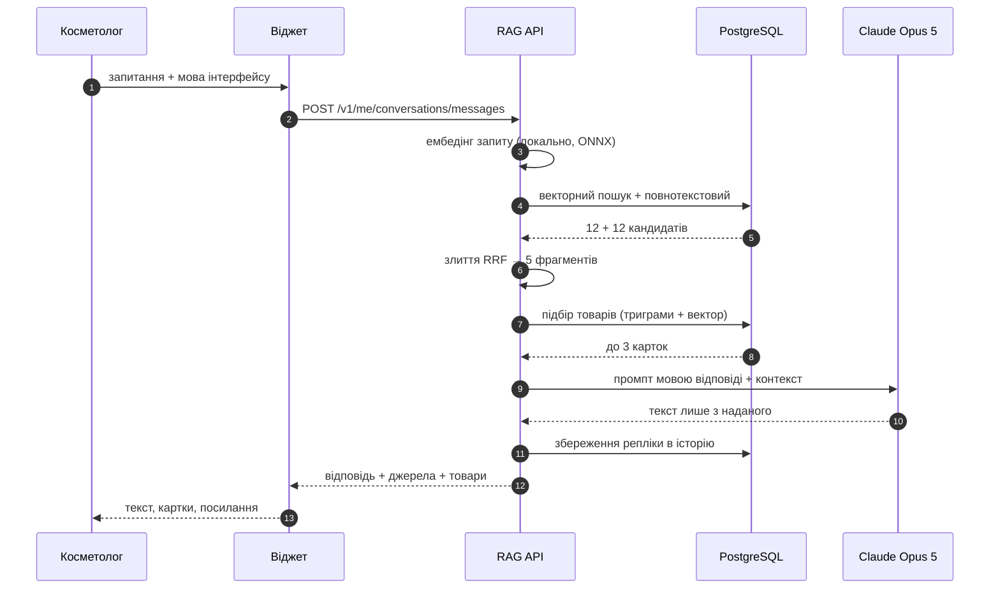
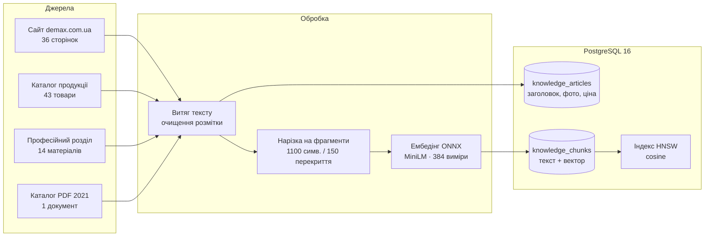
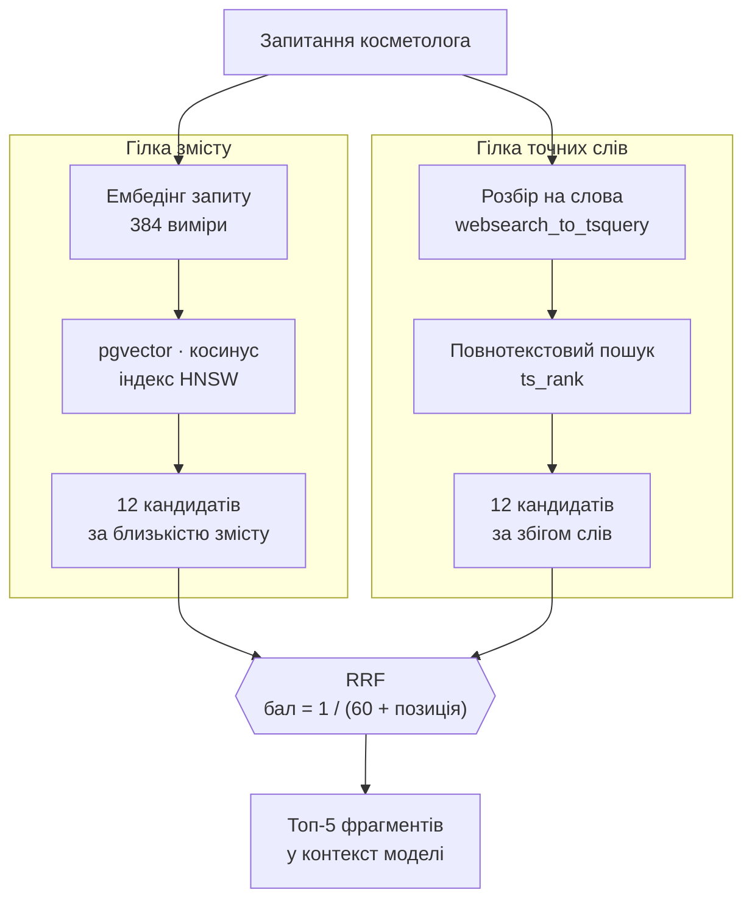
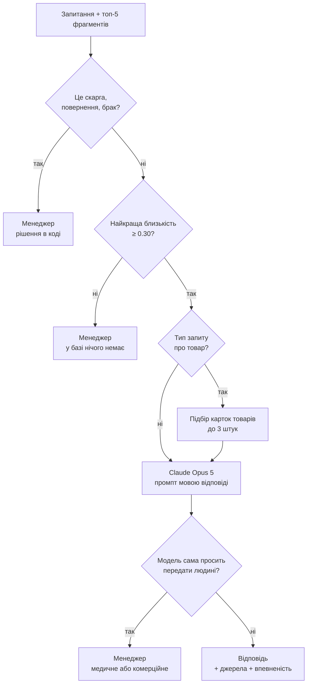
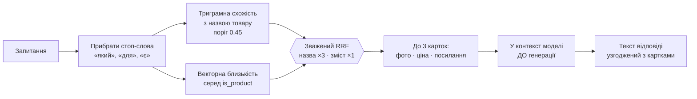
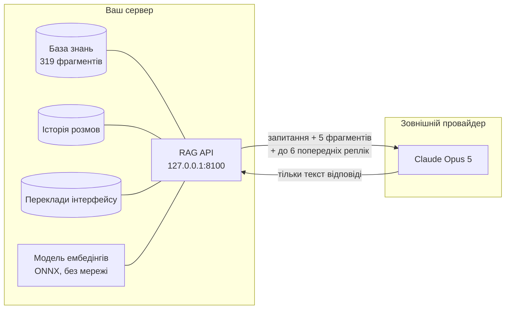

# Як влаштований RAG

Асистент не «знає» продукцію DEMAX — він щоразу шукає її в базі знань і відповідає
лише знайденим. Нижче — весь шлях одного запитання, з реальними числами з коду.

| Показник | Значення | Де в коді |
|---|---|---|
| Фрагментів у базі знань | 319 | — |
| Розмірність вектора | 384 | `db.py: EMBED_DIM` |
| Кандидатів на гілку пошуку | 12 | `rag.py: CANDIDATES` |
| Фрагментів у контекст моделі | 5 | `rag.py: TOP_K` |
| Розмір фрагмента / перекриття | 1100 / 150 символів | `ingest.py: CHUNK_SIZE` |
| Поріг ескалації (косинус) | 0.30 | `rag.py: ESCALATE_THRESHOLD` |

---

## 1. Загальний вигляд: один оберт

Косметолог пише запитання у віджет і за півтори–три секунди отримує відповідь,
під нею — джерела й, коли доречно, картки товарів. Між цими моментами система
робить тринадцять кроків, і назовні виходить лише один із них.

---

## 2. Індексація: звідки береться база знань

База збирається автоматично — обхід карти сайту demax.com.ua плюс каталог у PDF.
Перекриття між фрагментами потрібне, щоб думка, розірвана між двома фрагментами,
не загубилася.

> **Чому ембедінги локальні.** Це не оптимізація вартості, а межа периметра.
> Якби вектори рахував зовнішній сервіс, туди довелося б відправити всю базу знань
> цілком. Модель MiniLM працює на тому ж сервері — база не залишає його жодного разу.

---

## 3. Гібридний пошук і злиття RRF

Векторний пошук розуміє зміст: на «зволоження» він знайде фрагмент про гіалуронову
кислоту, навіть якщо цього слова там немає. Але він губиться на точних назвах.
Повнотекстовий — навпаки. Тому працюють обидва, а списки зводяться методом
**RRF** (Reciprocal Rank Fusion): фрагмент отримує `1 / (60 + позиція)` балів від
кожного списку. Той, що потрапив в обидва, майже завжди обходить лідера будь-якого одного.

**Як RRF обирає переможця** — розрахунок для запиту «крем для сухої шкіри»:

| Фрагмент | Позиція за змістом | Позиція за словами | Бал гілки 1 | Бал гілки 2 | Разом |
|---|---:|---:|---:|---:|---:|
| **Живильний крем — опис** | 2 | 3 | 0.0161 | 0.0159 | **0.0320** |
| Сторінка категорії «Догляд» | 1 | — | 0.0164 | 0 | 0.0164 |
| Каталог PDF, розділ кремів | — | 1 | 0 | 0.0164 | 0.0164 |
| Стаття про типи шкіри | 4 | — | 0.0156 | 0 | 0.0156 |

Перший рядок не був найкращим у жодному зі списків — і все одно виграв, бо його
підтвердили обидва методи. У цьому суть RRF: згода двох різних пошуків важить
більше, ніж упевненість одного. *(У коді позиції нумеруються з нуля — на порядок це не впливає.)*

---

## 4. Рішення: відповісти чи передати менеджеру

Найризикованіше, що може зробити консультант бренду, — впевнено вигадати факт.
Тому перед генерацією стоять три фільтри, і два з них працюють у коді, а не «на
розсуд моделі». Скарги передаються людині завжди: у тестах модель інколи бралася
сама відповідати на «прийшов бракований товар».

| Поведінка | Коли |
|---|---|
| Відповідає сам | Склад, застосування, протоколи, семінари — усе, що прямо описано в матеріалах бренду |
| Передає менеджеру | Скарги, ціни й опт, медичні протипоказання |
| Каже «не знаю» | Питання поза базою знань — вигадана відповідь коштує бренду дорожче за відсутню |

Якщо LLM недоступний, відповідь формується екстрактивно з фрагментів — сервіс
не падає, лише деградує.

---

## 5. Чому картки товарів шукаються окремо

Сторінки товарів короткі — назва, склад, кілька рядків опису. У загальному пошуку
вони програють розлогим оглядовим сторінкам категорій. Тому для карток працює
окремий пошук з іншими вагами: збіг за назвою важить `×3` проти `×1` за змістом.

Збіг за назвою рахується триграмами, а не словником: українська й російська —
флективні мови, і «для тіла» не збігається з «тілом» дослівно. На реальному
прикладі справжній збіг дав `0.50`, а шум — `0.167`, звідси поріг `0.45`.

> **Ключова деталь — порядок.** Товари шукаються *до* звернення до моделі й
> потрапляють у той самий контекст. Інакше виходив розрив, який ми спіймали в
> тестах: під відповіддю показувалися картки пептидних засобів, а текст над ними
> стверджував, що інформації немає.

---

## 6. Межа периметра: що залишає сервер

Назовні йде тільки саме запитання разом із п'ятьма знайденими фрагментами.
База знань, історія розмов і переклади інтерфейсу залишаються в PostgreSQL,
доступному лише з `127.0.0.1`.

Провайдер замінюваний — звернення до нього йде через одну функцію, тож перехід
на локальну модель не зачіпає решту системи.

Детальніше про потоки даних і модель загроз — у [SECURITY.md](SECURITY.md).
